# MTA-STS on Microsoft 365, with the policy hosted on GitHub Pages

The `id` on my own `_mta-sts` record reads `20260804045609Z`. And I published the first version of that record before there was anything behind it for a sender to fetch, so for a while jeffops.com was announcing a policy that did not exist.

Nothing broke. That is the problem with getting this wrong: it looks exactly like getting it right.

So this one is for anyone running mail on Microsoft 365 who would rather inbound TLS was required than hoped for. You do not need to be a mail specialist and you do not need a server. Twenty minutes, three DNS records and a free GitHub repository.

Here is the line the whole thing hangs on: **your inbound mail already uses TLS. That is not the same as requiring it.**

## But my mail is already encrypted?

It is. Every mail server that delivers to you already tries TLS. It sends `STARTTLS`, your server agrees, the session is encrypted, and everyone feels fine about it.

Now think about what happens when the handshake does not work. The sending server shrugs and delivers in plaintext instead, because that is what the protocol tells it to do. Nobody anywhere gets told.

That is the whole attack. Sit between two mail servers, strip `STARTTLS` out of the greeting, and the message arrives in the clear. No certificate warning, no bounce, no log entry that looks like anything.

It is the difference between asking for a signature and requiring one. A courier who is supposed to get a signature, finds nobody home, and puts the parcel through the letterbox anyway has still delivered it. You even get your parcel. You just never find out it spent the afternoon on the mat, and neither does the person who sent it.

MTA-STS is the signature requirement. It is a published promise, fetched over HTTPS, that says *this domain requires TLS, and here are the servers allowed to accept it*. A sender that reads that promise will not silently downgrade.

## What you are actually building

Three things, and only three:

1. A TXT record at `_mta-sts.yourdomain` saying a policy exists.
2. A policy file at `https://mta-sts.yourdomain/.well-known/mta-sts.txt`.
3. A certificate valid for `mta-sts.yourdomain` exactly, serving that file.

Point three is the one that catches people. The policy cannot live on your website. It has to be served from the `mta-sts.` subdomain, on a certificate for that host, over HTTPS. Which sounds like it needs a server. It does not. GitHub Pages will do it for nothing, and it will provision the certificate for you.

Next to that there is a fourth thing, not part of the standard and worth having anyway: TLS-RPT, a separate TXT record telling senders where to post reports when TLS fails. MTA-STS without TLS-RPT is a policy that never tells you it is breaking.

## First, find out where your DNS actually lives

I host my DNS at Microsoft 365 itself, so the screenshots here are the Microsoft 365 admin centre. Worth stating up front, because that is a different thing from having Microsoft 365 mail, and plenty of people have the second without the first. Your mailboxes can live in Exchange Online while your zone sits at your registrar, at Cloudflare, at Route 53, or on a domain controller in a cupboard.

Two ways to check. In the admin centre, go to **Settings → Domains → your domain → DNS records**. If there is an **Add record** button, Microsoft hosts your DNS. If instead the page names your DNS hosting provider and sends you there, Microsoft does not, and the records listed are only Microsoft telling you what it would like you to create elsewhere.

Faster, from a terminal:

```
nslookup -type=NS yourdomain.com
```

Microsoft-hosted zones answer with `ns1.bdm.microsoftonline.com` through `ns4`. Anything else and you are somewhere else.

**If Microsoft hosts your DNS**, the screenshots below are what you will see, and you inherit a ceiling. Hold that thought until the last section.

**If it does not**, nothing here changes except where you type. The three records are identical wherever they live: a CNAME at `mta-sts`, a TXT at `_mta-sts`, a TXT at `_smtp._tls`. But three things do differ by provider, and all three are worth knowing before you start.

**Relative names versus fully qualified ones.** Some control panels want `_mta-sts` and append the domain for you. Others want `_mta-sts.yourdomain.com` in full. Give the wrong one and you quietly create `_mta-sts.yourdomain.com.yourdomain.com`, which resolves for nobody and looks perfectly fine in the interface. So query the record after saving it, always, rather than trusting the panel.

**Cloudflare, specifically: the `mta-sts` record must be DNS only. Grey cloud, not orange.** Proxy it with your SSL mode on Full or Full (Strict) and GitHub cannot renew the certificate, because Cloudflare refuses to connect to an origin whose certificate has expired and the renewal is exactly what needs that connection. The failure mode is nasty. It works perfectly for ninety days, then breaks… and then keeps breaking every ninety days. Not really a Cloudflare bug so much as what happens with any CDN sitting between your domain and GitHub Pages.

**Underscore labels.** Most of the times you will never meet this one, but a few older registrar panels still refuse a record whose name begins with an underscore. If yours is one of them, MTA-STS is the least of it, because DMARC, DKIM and TLS-RPT all need the same thing. Move your DNS.

And there is one consolation for hosting elsewhere, a real one. Come back to the last section.

## Do it in this order

The order matters, and I got it wrong the first time, which is where this article started. Harmless in testing mode, and every checker simply reports "no policy", but it is backwards.

Build it so each step is only taken once the thing it points at is real:

1. The CNAME, so GitHub can verify the hostname and issue a certificate.
2. The repository and the policy file.
3. Pages, the custom domain, and HTTPS.
4. The TXT record, last, once there is genuinely something to fetch.

## Step 1: the CNAME

In the Microsoft 365 admin centre: **Settings → Domains → your domain → DNS records → Add record**.

Before you fill anything in, open the Type dropdown and look at it, because it tells you something about what you can and cannot do here later:

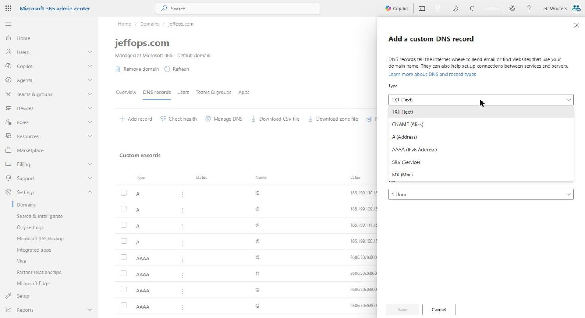

Six types. TXT, CNAME, A, AAAA, SRV, MX. That is the whole list. Note what is missing, because we come back to it at the end.

Add a CNAME. Host name `mta-sts`, pointing at your GitHub Pages host, which is `yourusername.github.io`:

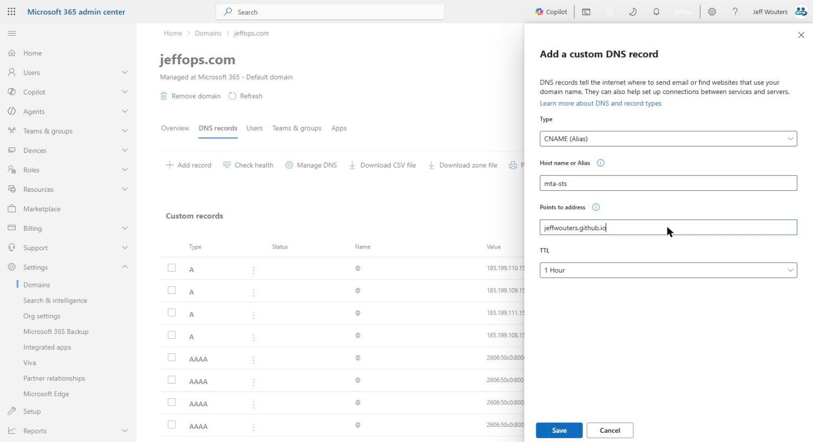

Save it, and let it settle. The TTL here is an hour, so if you race ahead to GitHub in the next thirty seconds you will sit staring at "DNS check in progress" for no reason at all.

## Step 2: a repository for the policy

The policy needs its own repository. Not a folder in your website repo, its own, because GitHub Pages allows exactly one custom domain per repo and yours is already spoken for by your site.

Create it public. Pages does not serve private repositories on a free account, and there is nothing secret in here anyway. The entire contents will be public DNS policy that you are actively trying to get strangers to read.

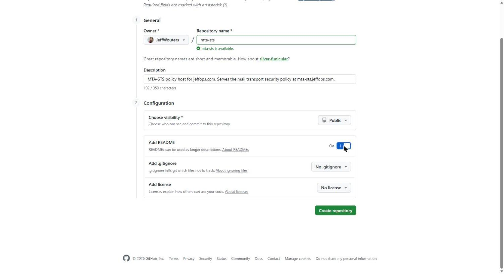

Then upload four files:

```
CNAME        mta-sts.yourdomain.com
.nojekyll    (empty)
index.html   (optional, a page for anyone who visits directly)
README.md    (optional, but future-you will want it)
```

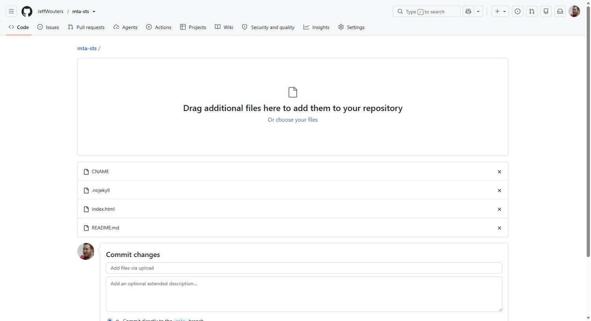

**`.nojekyll` is not optional and it is the single most likely thing to silently break this.** GitHub Pages runs Jekyll by default. Jekyll ignores every file and directory whose name begins with a dot. And the policy is required to live at `.well-known/mta-sts.txt`.

So without `.nojekyll` that path is never published, the URL returns 404, and every validator you try reports "no policy found" with no hint as to why. You will check your DNS four times before you think of Jekyll. I did… four times.

## Step 3: the policy file

Create `.well-known/mta-sts.txt`. In the GitHub web editor you can type the whole path into the filename box and it makes the directory for you.

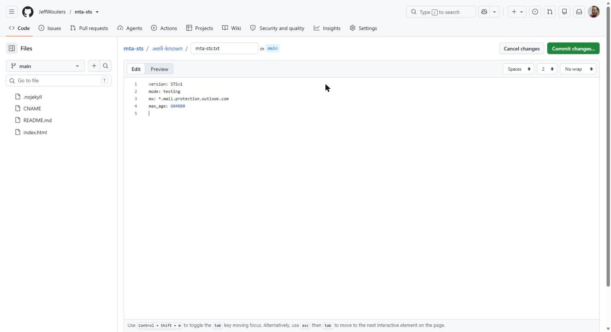

```
version: STSv1
mode: testing
mx: *.mail.protection.outlook.com
max_age: 604800
```

Four lines, and three of them deserve a sentence.

**`mode: testing`** means a sending server that cannot establish valid TLS reports the failure and delivers the mail anyway. Nothing can be lost while this is set. The alternative, `enforce`, means it refuses to deliver instead. So start in testing. Always.

**`mx:`** must match your real MX records. For Microsoft 365 that is `yourdomain-com.mail.protection.outlook.com`, and the wildcard `*.mail.protection.outlook.com` covers it, because `*` matches the leftmost label only and that is one label. Get this wrong and, once you move to enforce, senders will start refusing to deliver to you. So check it against your actual MX record rather than trusting a template… including this one.

**`max_age: 604800`** is seven days, which is how long a sender caches the policy. Short while testing. Longer once you are confident.

The repository should now look like this:

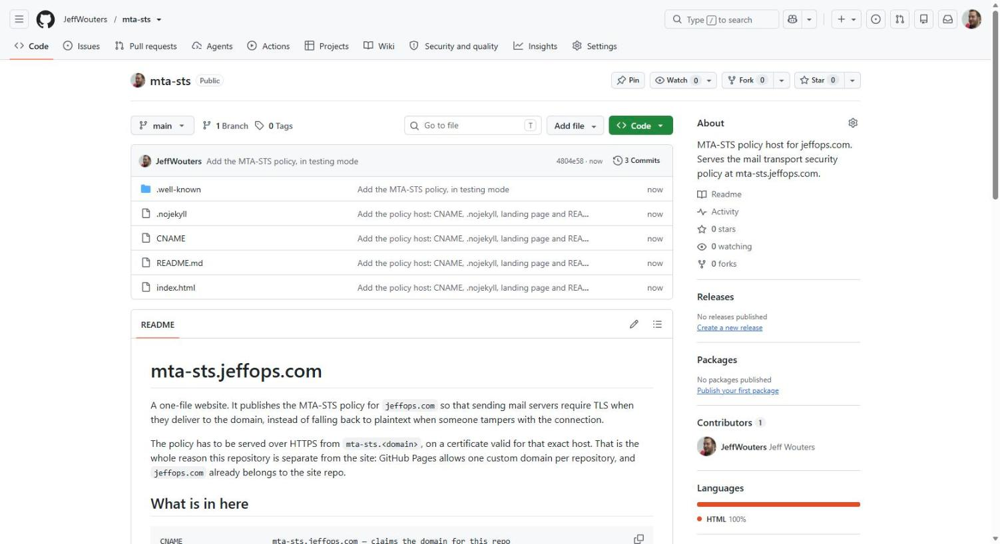

## Step 4: turn on Pages

**Settings → Pages → Source: Deploy from a branch**, branch `main`, folder `/ (root)`.

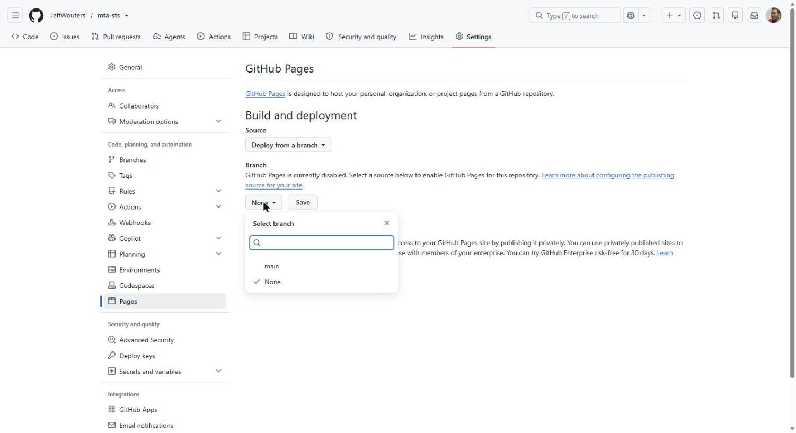

The custom domain fills itself in from your CNAME file. Because you added the DNS record first, the check passes immediately rather than sitting in "in progress":

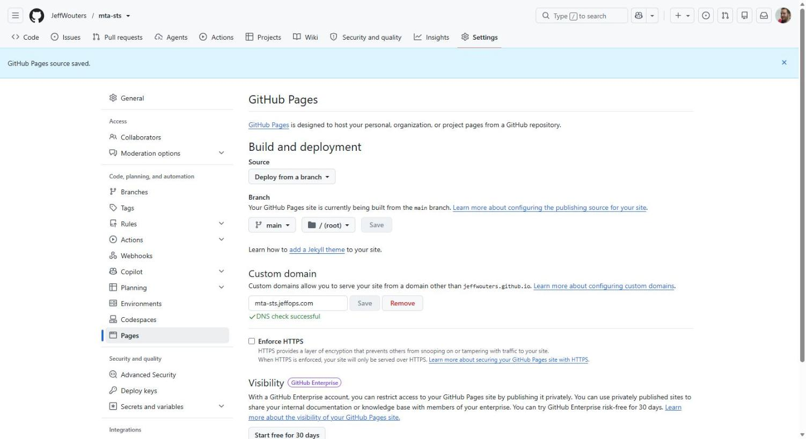

Give it a couple of minutes for the certificate, then tick **Enforce HTTPS**:

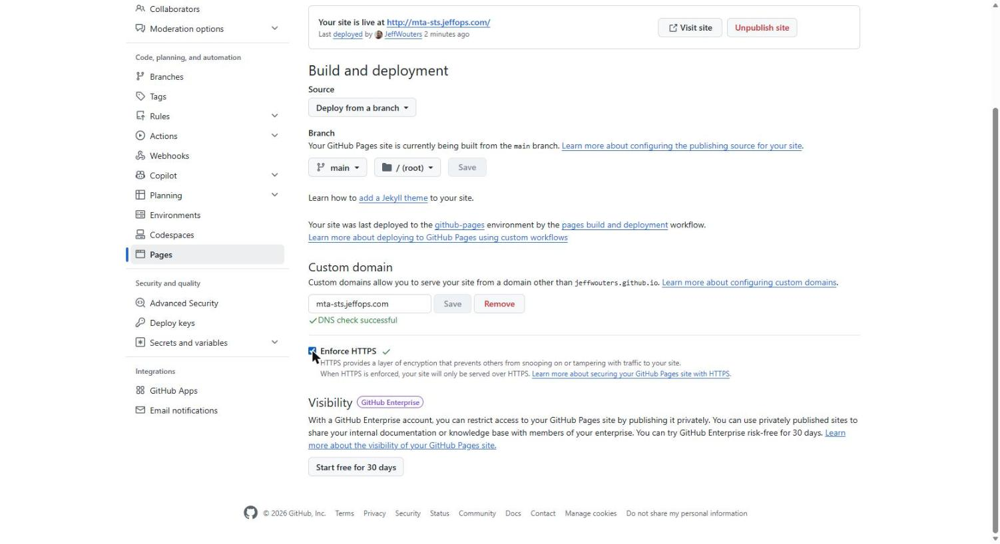

Now confirm the policy is actually being served, over HTTPS, with a valid certificate. Load the URL in a browser. If you typed `http://` and it upgraded itself to `https://` without a warning, that is the certificate working:

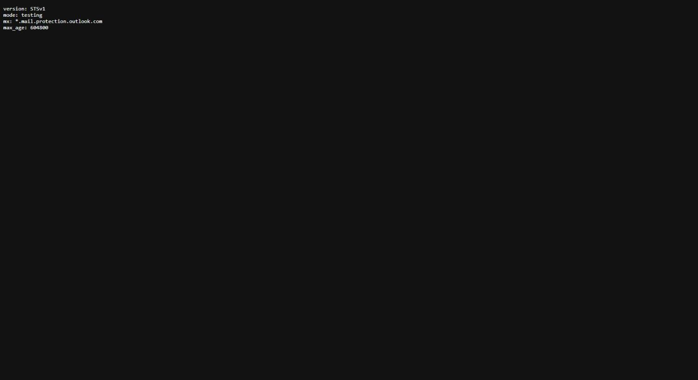

## Step 5: the TXT record, now that it points at something

Back to the admin centre. Add a TXT record, name `_mta-sts`, value:

```
v=STSv1; id=20260804045609Z
```

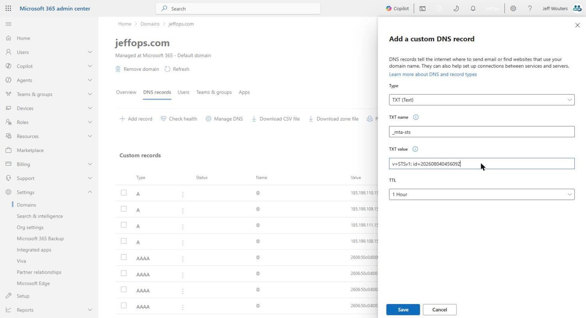

The `id` is an opaque string of at most 32 alphanumeric characters. It has no meaning to anything. A UTC timestamp is the convention because it makes the last change self-documenting, which is the only reason you know when I did mine.

And it carries the second trap. **Senders cache the policy and only re-fetch it when the `id` changes.** So edit `mta-sts.txt` without bumping the `id` and you have changed nothing at all, for up to `max_age`. Every time you touch the policy file, change the id in DNS.

## Step 6: TLS-RPT

One more TXT record, at `_smtp._tls`:

```
v=TLSRPTv1; rua=mailto:you@yourdomain.com
```

That is the bit that tells you when TLS to your domain is failing. It has no enforcement behaviour of its own and no way to break anything. There is no good reason to run MTA-STS without it.

## Step 7: check it from outside

Do not take your own word for it, and do not take mine. Run it through an external validator:

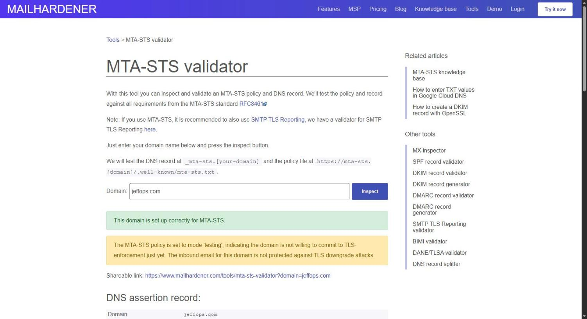

The detail is where the useful confirmation lives. Policy fetched, HTTP 200, correct content type, certificate valid, and the policy service marked valid:

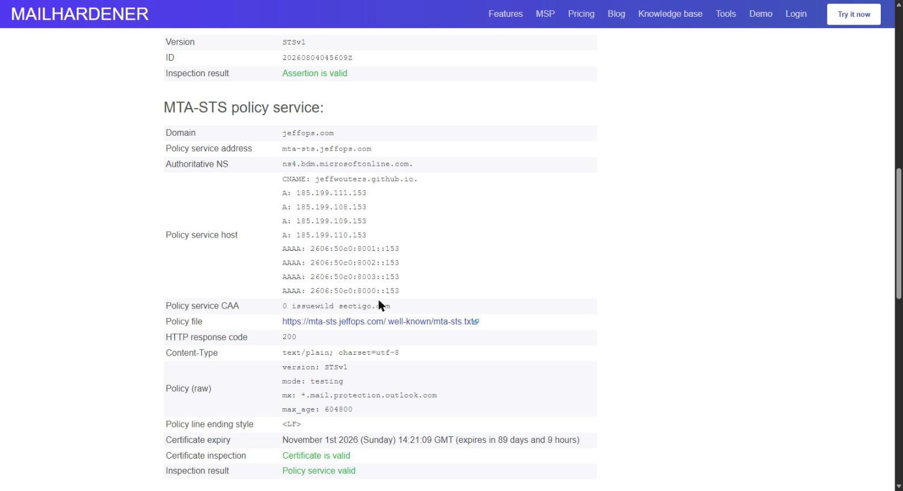

Worth reading that panel properly rather than stopping at the green box. It tells you the resolved address of your policy host, the CAA records it inherits, the raw policy, the line ending style, and the certificate expiry. If anything is going to be quietly wrong, it will be visible there.

## Moving to enforce

Leave it in testing for a few weeks and read the TLS-RPT reports. When they are quiet, change `mode: testing` to `mode: enforce`, bump the `id`, and consider raising `max_age`.

Enforce is the point of the exercise. It is also the mode where a wrong `mx:` line stops mail reaching you, which is why the MX pattern got its own paragraph earlier and why testing exists at all.

## The ceiling, if Microsoft hosts your DNS

Go back to that dropdown from step one. Six record types, and no CAA.

CAA is the record that says which certificate authorities are allowed to issue certificates for your domain. Without one, any CA on earth can. Microsoft's DNS hosting does not offer the record type, so on a domain hosted there you simply cannot have one. Nor DNSSEC, which is not on that list either.

There is a small irony in what you have just built. `mta-sts.yourdomain` ends up better protected than your apex, because it is a CNAME to `github.io` and inherits GitHub's CAA records through it. The validator screenshot above shows exactly that. Your main domain has nothing equivalent.

Your policy host is safer than the domain it exists to protect!

**All of you hosting DNS somewhere other than Microsoft:** this is the consolation I promised. At Cloudflare, Route 53, or most registrars worth the name, CAA is a record type like any other and DNSSEC is a toggle. Add both while you are in there. It is ten minutes and it closes a gap this article cannot.

And if you are on Microsoft's DNS and either matters to you, the fix is not a setting. It is moving your zone somewhere that supports them, which is a (much) bigger decision than an afternoon of MTA-STS and not one to make on the way past.

## What you end up with

Three DNS records, one small repository, and about twenty minutes. Inbound mail that used to encrypt itself when convenient now encrypts itself because your domain says so, and tells you when it cannot.

MTA-STS is a tool to enhance the TLS you already had, not to replace it.

It just stops it being optional.
