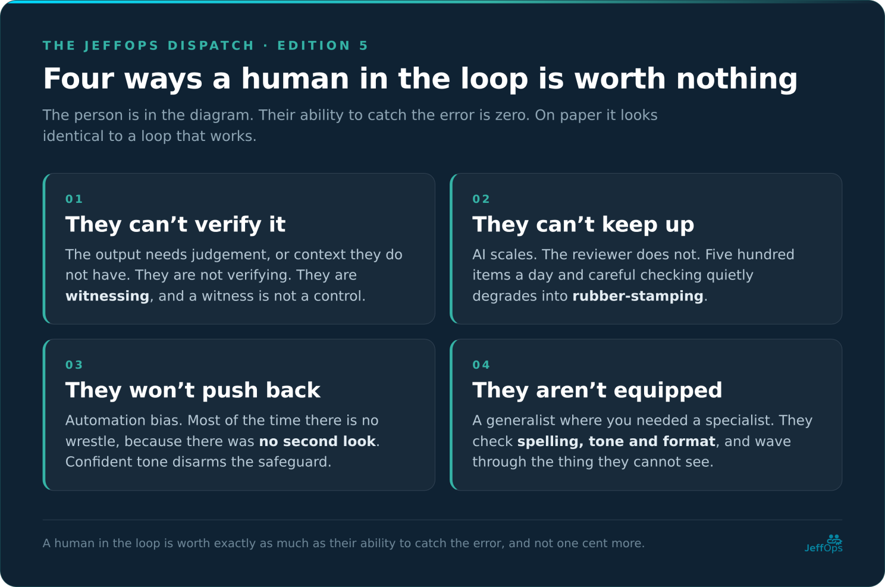
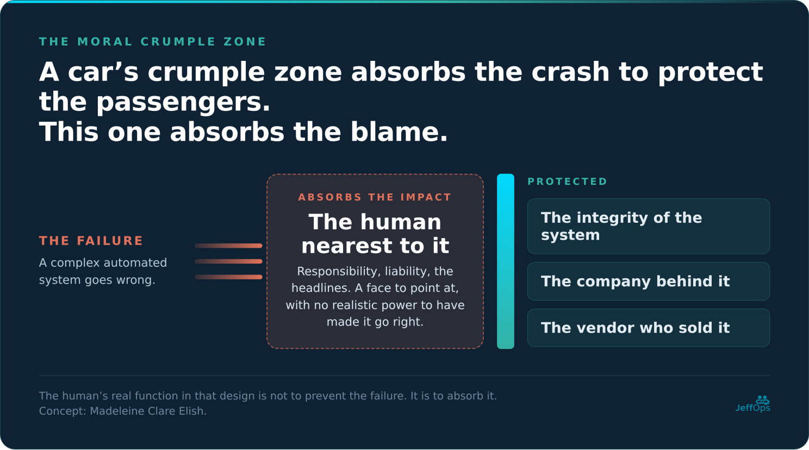
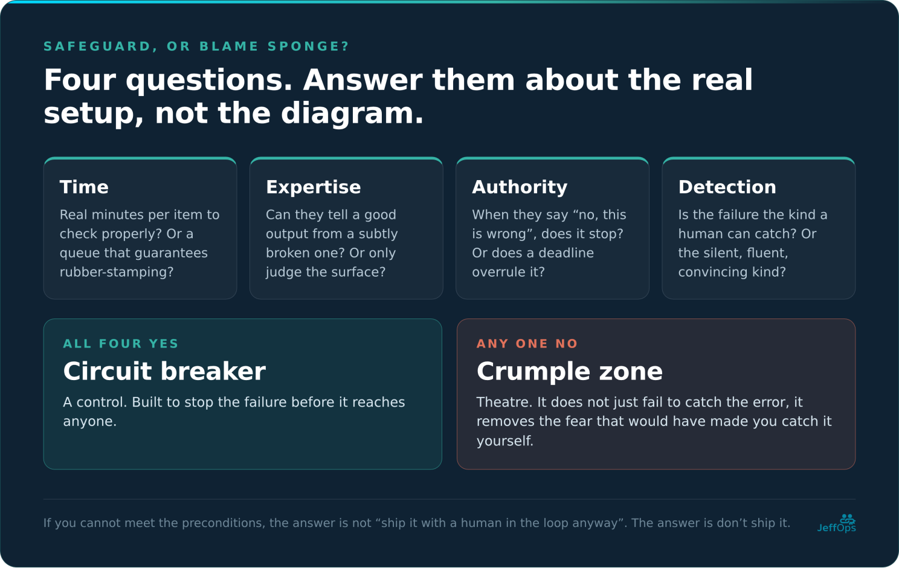

Twice in this series I have told you to keep a human in the loop. Once in the piece on plotting AI to your business, and again last edition, where I handed you four rules for naming a human owner and called the whole thing accountability.

Both times I gave it to you like it was a solution. It wasn’t. Here is the line this whole edition hangs on: **a human in the loop is worth exactly as much as their ability to catch the error, and not one cent more.**

So, this one is for anyone with an AI workflow running right now that has a name written next to it. And for the person whose name that is, who may not know what they are holding.

I ended the last edition on a cliffhanger, and this is me paying it off. Right after telling you to make a named human accountable for every AI outcome, I admitted the catch: that only works if the human can actually catch the error. Sometimes the person in the loop is there to absorb the blame rather than prevent the failure. Safeguard, or blame sponge? I said we would find out.

At best that advice was raw material. At worst, and it is the worst far more often than anyone admits, it is the exact mechanism by which a business manufactures a scapegoat and calls it governance.

## What the human in the loop is actually for

Strip away the comfort and a human in the loop has exactly one job: to catch the error. To look at what the machine produced, know whether it is right, and stop it when it is wrong. That is it. That is the whole value. Not to be present. Not to be named in a policy. To catch it.

And here is the part that should make you uncomfortable about your own setup. That ability is often zero. Sometimes zero by accident, sometimes zero by design, and in almost every case the organisation has no idea it is zero, because the human is sitting right there in the diagram, looking for all the world like a safeguard.

There are four ways that ability collapses to nothing.

## 1. They can’t verify it

Some tasks cannot be checked. Not “are hard to check”. Cannot, in principle, be verified quickly enough to matter.

I made this the third question of my own AI Fit Test: can you verify the output? And I will be honest about what I quietly glossed over when I wrote it. I treated verifiability as a property of the task. It is not. It is a property of the task **and** the human you assigned to it.

A verifiable task with a reviewer who cannot perform the verification is an unverifiable task wearing a hi-vis vest.

If the human in the loop cannot independently tell right from wrong on this specific output, because it needs judgement, or context they do not have, or a level of scrutiny the workflow does not allow, then they are not verifying anything. They are witnessing. And a witness is not a control.

## 2. They can’t keep up

Say the task is verifiable and the human genuinely could catch the error. Once. Carefully. With coffee and time. Now give them five hundred of those tasks a day.

This is the failure nobody wants to cost out, because it is the one that makes the business case work. The whole pitch of AI is volume: more, faster, cheaper. But the human in the loop does not get faster.

So, what actually happens is that the drowning reviewer stops reviewing and starts rubber-stamping. They approve on vibes. They spot-check one in fifty and trust the rest. “Human in the loop” quietly degrades into “human near the loop, occasionally glancing at it”. The overseer is technically present and functionally gone, and the throughput numbers look fantastic right up until the one that matters sails through unread.

## 3. They won’t push back

This is the ugly one, because it is not about capacity or skill. It is about wiring. Yours.

There is a well-documented phenomenon called automation bias: humans tend to favour what an automated system tells them over the other information sitting in front of them, even when that other information is correct. Kathleen Mosier and Linda Skitka named its two flavours in the nineties, and both should worry you. Omission, where the automation says nothing about a problem and you do not act, because it never flagged it. Commission, where you act on what the automation tells you without cross-checking what is right next to it. Note that neither of those requires you to notice anything.

That is the part people get wrong. They picture a reviewer wrestling with doubt and losing. Most of the time there is no wrestle, because there was no second look. The harder version is real, where you see the contradiction and defer anyway, and it is much rarer than the version where you simply never checked. Which is the trap inside the trap. You put the human there to be a check, and the psychology quietly re-points their instincts to defend the machine instead.

Now connect it to the thing I hammered in the very first edition: the illusion of competence. AI fails convincingly. Its wrong answers are as fluent and as confident as its right ones. And here is the finding that ties the bow. Studies show that when you display the automation’s confidence, people become more likely to go along with the high-confidence output, with no actual improvement in accuracy.

So the confident tone does not merely fail to help your reviewer. It disarms them. The very thing that makes AI dangerous is the very thing that makes your safeguard defer to it. Your human in the loop is fighting their own neurology and losing.

## 4. They aren’t equipped

The quietest failure. You needed a specialist in the loop and you put a generalist there, because “there’s a human checking it” felt like enough and the specialist was (of course) expensive.

There is a human checking it. They cannot tell a subtle-but-catastrophic answer from a correct one, because the task demands expertise they do not have. So they check the things they can see, being spelling, tone and format, and wave through the thing they cannot.

The loop is staffed. The loop is useless. And on paper it looks identical to a loop that works.

## The moral crumple zone

Here is where I stop being a smart-ass and hand you somebody else’s concept, because it will change how you see every one of these setups.

The cultural anthropologist named Madeleine Clare Elish studied what happens to accountability in heavily automated systems, and gave the pattern a name: the moral crumple zone. A car’s crumple zone is engineered to absorb the force of a crash, protecting the passengers by sacrificing itself. A moral crumple zone does the same thing with blame. When a complex automated system fails, the human operator nearest to it absorbs the impact, the responsibility, the liability, the headlines. And in doing so protects the integrity of the system. Next to that, it protects the company behind it, and the vendor who sold it.

The human’s real function in that design is not to prevent the failure. It is to absorb it. A face to point at when things go wrong, with no realistic power to make things go right.

Elish builds the concept on two accidents, and then points it at a third that happened while she was writing.

**Three Mile Island, 1979.** Partial nuclear meltdown. The Kemeny Commission that investigated it ranged wide: it demanded fundamental change in the attitudes of the regulator and the industry, called operator training greatly deficient, found procedures that could be read as leading operators to the wrong action, and described a control room with hundreds of alarms and no way to suppress the unimportant ones. In the newspapers it became operator error. “Nuclear Accident Blamed Primarily on Human Error”, ran the Los Angeles Times. The operators were the crumple zone, and it was the coverage that put them in it.

**Air France 447, 2009.** 228 people dead in the Atlantic. The pitot tubes iced over, the airspeed readings disagreed, and the autopilot disconnected. Which is exactly what it was built to do. Elish’s line on it is the one that should stop you cold: “because the autopilot did not malfunction in a way recognized through its certification process, the only possible malfunction, systemically, is the human pilot.” Note that this is a claim about certification logic rather than about the investigation, which named the pitot probes, the stall warning, the airspeed display and high-altitude handling training as well. But inside the framework that decides what is allowed to count as a fault, the human was the only thing that could be one. That is a moral crumple zone by design, not by accident.

And the third, which opens her paper rather than featuring as a case study in it:

**Uber, Tempe, 2018.** Elaine Herzberg, the first pedestrian killed by a self-driving car. The safety driver was positioned to supervise a system she had almost no realistic way to meaningfully supervise in that split second, and she became the locus of responsibility. She pleaded guilty to endangerment and got probation. Prosecutors declined to charge Uber at all, in a case where the NTSB had found the factory emergency braking disabled, the company’s own software suppressing braking for a full second while it decided, and no mechanism anywhere for managing the operator complacency the whole arrangement depended on.

There is a tell that the industry knows this problem is real. Google’s self-driving programme concluded it could not reliably solve the handoff, passing control back to a human for exactly the rarest, hardest, most dangerous moments, and changed its whole approach because of it.

Think about what that means for your office workflow. A company with self-driving-car money looked at “human catches the edge cases the machine can’t” and decided it does not work well enough to bet lives on. And you are relying on it to catch a hallucinated figure in a report nobody has time to read!

Now hold that concept up against my own advice. “Name a human owner for every AI outcome.” I wrote that. I meant it as accountability. But look how cleanly it can be perverted. The dishonest way to satisfy “name an owner” is to name someone who cannot do the job, with no time, no expertise, no authority and no real ability to catch the error, and let them hold the responsibility anyway.

You will have followed my advice to the letter. You will have built a moral crumple zone and filed the paperwork that proves it.

I told you to name a defendant and I called it governance. That one is on me, and I am correcting it here.

## Four questions, and answer them about the real setup

You have a human in the loop somewhere in your business right now. Is it a safeguard or a sponge? Answer these honestly, about what actually happens, not about the diagram.

**Do they have the time?** Real minutes per item to check properly, or a queue that guarantees rubber-stamping?

**Do they have the expertise?** Can this person genuinely tell a good output from a subtly broken one on this task, or only judge the surface?

**Do they have the authority?** When they say “no, this is wrong”, does it stop? Or do they get overruled by a deadline, a manager, or a throughput target?

**Can they detect the error at all?** Is the failure the kind a human can catch, or the silent, fluent, convincing kind that slips past everyone, including them?

Those four should look familiar. They are last edition’s rules for naming an owner, flipped from instructions into a test.

Any “no” and you do not have oversight. You have theatre. All the world's a stage, and your reviewer is merely a player. A person positioned to look like a control while being structurally incapable of acting as one.

And the cruel part is that theatre is worse than an honest absence. An empty loop makes you nervous enough to check. A staffed-but-useless loop makes you feel safe. It does not just fail to catch the error. It removes the fear that would have made you catch it yourself.

## Where that leaves “keep a human in the loop”

Demoted. From a solution to a precondition that has preconditions of its own.

Adding a human is not a safeguard. It is the raw material for one. It becomes a safeguard only when that human clears all four criteria above, and it reverts to a crumple zone the moment they miss even one. Meet them and the loop is a circuit breaker, built to stop the failure. Miss them and it exists only to absorb the blame for a failure the safeguard was never able to prevent.

And here is what I most need you to take from all of this, because it follows from everything above and it is harder than anything I have said in this series so far. If you cannot meet those preconditions for a given use case, if there is no human who can actually catch the error at the speed and the scale you need, then the answer is not “ship it with a human in the loop anyway”. The answer is don’t ship it.

Adding an overwhelmed, underqualified, unheard human to an unsafe system does not make it safe. It just decides, in advance, who takes the fall.

So don’t put a human in the loop so that you can *feel* safe. Put one there who can make you safe, or don’t automate that thing at all. A tool to enhance the judgement of someone who has some, not to replace it with a signature.

A human in the loop is a safeguard. A human on the hook is a sponge. Most businesses cannot tell which one they have built right up until it fails, and a real person who never stood a chance of catching the fail gets handed the blame the system was quietly designed to shed.

Make sure you know which one you built. Before it matters 😉
